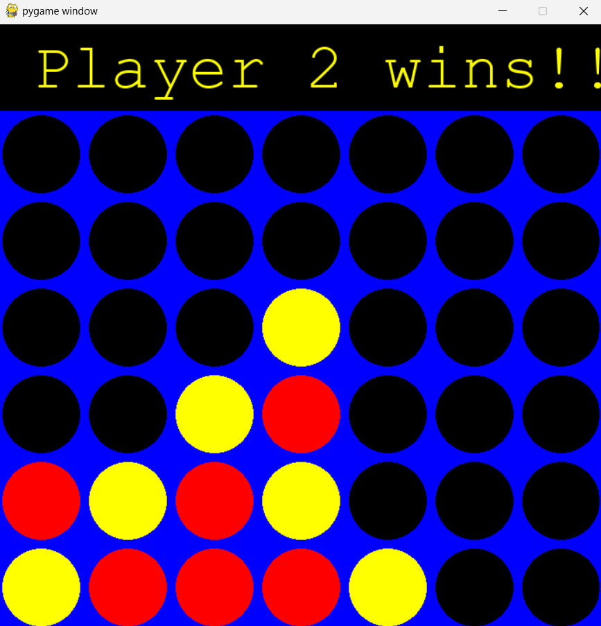

# Connect Four AI - Nhóm 3


An implementation of the classic Connect Four game with an intelligent AI opponent using the Minimax algorithm with Alpha-Beta pruning optimization.

## 📋 Table of Contents

- [Team](#team)
- [Overview](#overview)
- [Features](#features)
- [Installation](#installation)
- [Project Structure](#project-structure)
- [Usage](#usage)
- [Algorithm](#algorithm)
  - [Minimax and Alpha-Beta Pruning](#minimax-and-alpha-beta-pruning)
  - [Q-Learning Enhancement](#q-learning-enhancement)
  - [Optimizations](#optimizations)
- [Client - Server Mode](#client---server-mode)
- [References](#references)

## Team

- Nguyễn Văn Biển `23021477`
- Nguyễn Quang Hiếu `23021551`
- Tô Ngọc Hải `23021543`
- Đỗ Phương Thảo `23021721`

## Overview

Connect Four is a two-player connection board game where players take turns dropping colored discs into a 7-column, 6-row vertically suspended grid. The objective is to be the first to form a horizontal, vertical, or diagonal line of four discs. This implementation features an AI opponent that uses advanced game theory algorithms to provide a challenging experience.

## Features

- Full implementation of Connect Four game rules
- Advanced Minimax algorithm with Alpha-Beta pruning
- Performance optimizations using transposition tables
- Move ordering for improved Alpha-Beta efficiency

## Installation

**1. Clone this repository:**
```bash
git clone https://github.com/nguyenbien8/connect4.git
cd connect4
```

**2. Install the required dependencies:**

```bash
pip install -r requirements.txt
```

## Project Structure

```bash
connect4/
├── data/                # Game data storage
├── images/              # Game images
├── models/              # Model implementations
├── online_mode/         # Client-Server mode
├── app.py               # Main application file
├── connect4_AI_People.py # Human vs AI implementation
├── Dockerfile           # Docker configuration
├── README.md            # Project documentation
└── requirements.txt     # Project dependencies
```

## Usage

If you want to play connect 4 game between human and computer using interface, please follow the command below:

Run the game using Python:

```bash
python connect4_AI_People.py
```

Play and enjoy the game with the game interface. The human and machine in the game will have a random order of going first. Below is a demo of the interface when you play human vs computer mode:



*Demo AI wins*

## Algorithm

### Minimax and Alpha-Beta Pruning

The Minimax algorithm is used to determine the optimal move for the AI player. It works by recursively exploring the game tree, evaluating positions, and selecting moves that maximize the AI's chances of winning while assuming the opponent plays optimally.

Alpha-Beta pruning is an optimization technique for the Minimax algorithm that significantly reduces the number of nodes that need to be evaluated in the search tree.

Core implementation:

```python
def minimax(board, depth, alpha, beta, maximizing_player):
    valid_moves = get_valid_moves(board)
    
    # Convert board to hashable format
    board_tuple = tuple(tuple(row) for row in board)
    state_key = (board_tuple, depth, maximizing_player)

    # Check transposition table
    if state_key in transposition_table:
        return transposition_table[state_key]

    # Check terminal conditions
    is_terminal = is_terminal_node(board)
    if depth == 0 or is_terminal:
        if is_terminal:
            if winning_move(board, AI_PIECE):
                result = (None, 10000000)
            elif winning_move(board, PLAYER_PIECE):
                result = (None, -1000000)
            else:
                result = (None, 0)
        else:
            result = (None, score_position(board, AI_PIECE))
        transposition_table[state_key] = result
        return result
    
    # Maximizing player (AI)    
    if maximizing_player:
        value = -math.inf
        column = None
        sorted_moves = sort_valid_moves_with_boards(valid_moves, board, AI_PIECE)
        for col, _, board_copy in sorted_moves:
            new_score = minimax(board_copy, depth-1, alpha, beta, False)[1]
            if new_score > value:
                value = new_score
                column = col
            alpha = max(alpha, value)
            if alpha >= beta:
                break
        transposition_table[state_key] = (column, value)
        return column, value
    
    # Minimizing player (opponent)
    else:
        value = math.inf
        column = None
        sorted_moves = sort_valid_moves_with_boards(valid_moves, board, PLAYER_PIECE)
        for col, _, board_copy in sorted_moves:
            new_score = minimax(board_copy, depth-1, alpha, beta, True)[1]
            if new_score < value:
                value = new_score
                column = col
            beta = min(beta, value)
            if alpha >= beta:
                break
        transposition_table[state_key] = (column, value)
        return column, value
```

### Q-Learning Enhancement

The Q-Learning implementation provides a reinforcement learning approach to the Connect Four game. This algorithm learns optimal strategies through experience rather than pure calculation.

#### Q-Learning Architecture

The `PlayQlearning` class initializes with player information (player = 1 or 2) and maintains a `Q-table` as a dictionary mapping board states to arrays of `Q-values`. Each state is represented as a string of 42 characters (HEIGHT × WIDTH), where each character represents a cell's value (`0: empty`, `1: player`, `2: opponent`).

```python
Q-table structure:
{
    "board_state_string": [q_value_col0, q_value_col1, ..., q_value_col6]
}
```

#### Move Selection

During gameplay, the AI selects moves using the `findBestMove()` function, which:
1. Retrieves the `Q-values` for the current board state
2. Selects the column with the highest `Q-value`
3. If that column is full, sets its `Q-value` to -1.0 to exclude it from consideration
4. Records the state and action in the history list for later updates

#### Learning Mechanism

After each game, the `finalResult(winner)` function updates the `Q-table` using a temporal difference learning approach:
1. Determines the game outcome with corresponding rewards: 
- Win: 1.0
- Draw: 0.5
- Loss: 0.0

2. Processes the history of moves in reverse order, updating `Q-values` using the formula:

```bash
Q(s,a) ← Q(s,a) + α[r + γ·max(a')Q(s',a') - Q(s,a)]
```

Where:
- `α = 0.9` (learning rate): Determines how much new information overrides old information
- `γ = 0.95` (discount factor): Values future rewards
- `Q(s,a)`: Current `Q-value` for state s and action a
- `max(Q(s'))`: Maximum `Q-value` for the next state `s'`

#### Training Process

The training process uses the `trainQLearning()` function:

1. Creates two Q-learning agents (playerQ1 and playerQ2)
2. Has them play against each other for a specified number of games
3. Randomly selects who goes first in each game
4. Updates `Q-values` after each game based on the outcome

Additional functionality is provided through the play() function, which can:

1. Run matches between Minimax and Q-learning agents
2. Track win ratios across multiple games
3. Pre-train Q-learning agents before competitive play

### Optimizations

**1. Transposition Table**

```python
# Check transposition table
if state_key in transposition_table:
    return transposition_table[state_key]
```

The transposition table stores previously calculated positions to avoid redundant calculations, greatly improving performance.

**2. Move Ordering**

```python
def sort_valid_moves_with_boards(valid_moves, board, piece):
    scored_moves = []
    for col in valid_moves:
        row = get_next_open_row(board, col)
        if row != -1:
            board_copy = drop_piece(board, row, col, piece)
            score = score_position(board_copy, piece)
            scored_moves.append((col, score, board_copy))
    scored_moves.sort(key=lambda x: x[1], reverse=True)
    return scored_moves
```

Moves are sorted by potential score, allowing Alpha-Beta pruning to work more efficiently by evaluating the most promising moves first.

**3. Memory Optimization**

```python
# Convert board to hashable format
board_tuple = tuple(tuple(row) for row in board)
state_key = (board_tuple, depth, maximizing_player)
```

Converting the board to tuples allows for efficient storage and lookup in the transposition table.

**4. Table Management**

```python
def manage_transposition_table():
    global transposition_table
    if len(transposition_table) > MAX_TABLE_SIZE:
        transposition_table.clear()
```

Prevents memory issues by clearing the transposition table when it becomes too large.

## Client - Server Mode

Connect Four AI supports a multiplayer mode allowing two players to compete over a network using a client-server architecture.

### Network Features

- Real-time two-player gameplay over local network or internet
- Server-side game state management and move validation
- Automatic turn coordination between players
- Visual indicators showing connection status
- Error handling for network disruptions

### Server

Key server functions:

- `init_server(screen)`: Initializes and runs the server with a Pygame display
- `Connect4Server.run()`: Starts the server and manages client connections
- `handle_client()`: Processes communication with each connected player
- `process_move()`: Validates and applies player moves on the server
- `update_all_clients()`: Synchronizes game state to all connected players

### Client

Client functions:

- `connect_to_server(server_ip, port)`: Establishes connection to a server
- Receives player ID (1 or 2) from server
- Sends move requests when it's the player's turn
- Receives board updates after each move
- Displays game state and connection status

```python
def connect_to_server(server_ip='127.0.0.1', port=12345):
    try:
        sock = socket.socket(socket.AF_INET, socket.SOCK_STREAM)
        sock.connect((server_ip, port))
        return sock
    except Exception as e:
        print(f"Connection error: {e}")
        show_error_message(f"Cannot connect to server at {server_ip}")
        return None
```

### Communication Protocol

The client and server exchange simple text messages:

- Player assignment: Server sends player `ID (1 or 2)`
- Turn management: `your_turn` or `wait:{player_id}`
- Move submission: Client sends column number (0-6)
- Board updates: `board:{state}:{current_player}`
- Game outcomes: `win:{player_id}` or `opponent_disconnected`

## References

🐙 **GitHub**:
   - [GitHub - Connect Four AI Implementations](https://github.com/topics/connect-four)
   - [GitHub - Minimax Algorithm Examples](https://github.com/topics/minimax)

▶️ **YouTube**: [Keith Galli](https://www.youtube.com/@KeithGalli)

🤖 **ChatGPT**